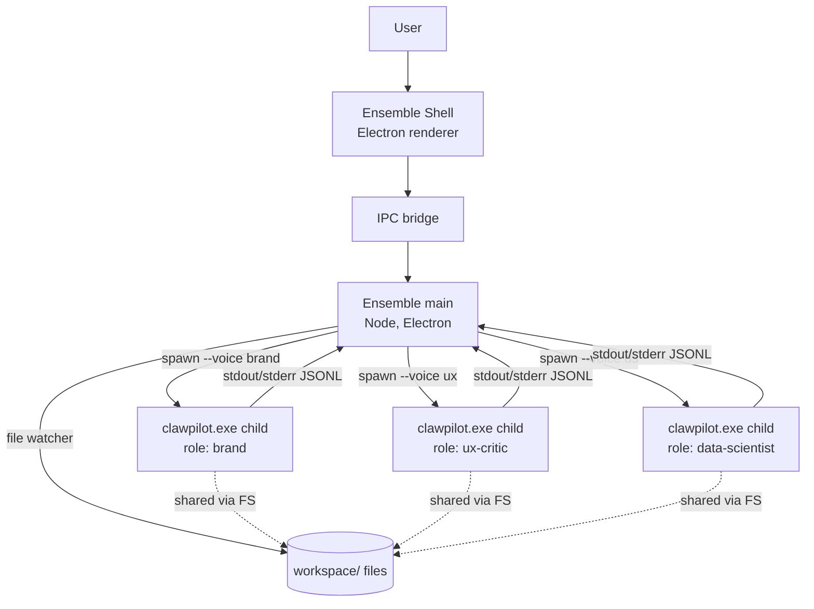
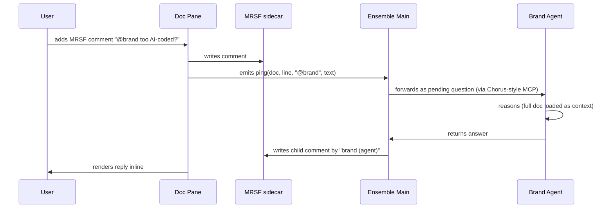

# Ensemble — integrated workspace on top of Clawpilot

> **One-liner:** Ensemble is the integrated desktop workspace for Clawpilot. Open a markdown file → it opens in Ensemble's Chorus-class viewer. Open an agent → it opens as a prompt pane. Drop a comment in a doc → ping Clawpilot directly. Convene multiple role-scoped agents (data scientist, UX critic, brand voice, …) side-by-side. Files, agents, comments, and tasks all live in one shell where everything can talk to everything else.

> **Reframe (2026-05-07 turn 2):** Ensemble is not a "council UI on top of Clawpilot." It's the **workspace itself**. Files and agents are first-class peers. The Council pattern is one of several layouts. The integration is the product — MRSF comment → @clawpilot ping → role-scoped reply, with no context-rebuilding because the workspace already knows what doc, what project, what role.

**Status:** product design draft · 2026-05-07
**Owner:** Patrik Lowendahl
**Codename family:** Symbiont (siblings: **Augur** sense · **Stride** act · **Chorus** collaborate · **Ensemble** convene)

---

## 1. Problem

Clawpilot today is a single-thread agent: one process, one context window, one persona at a time. The substrate underneath it is already multi-tenant — Voices, Projects (tier 1/2 Context Inference Models), Skills, Pipelines, MCPs — but you can only inhabit **one** of those configurations per session. Switching means typing `/load`, retyping prompts, losing parallelism.

In real work, expertise is plural:

- A pricing page rewrite needs a **brand voice**, a **UX critic**, and an **A/B-testing data scientist**.
- A CSU monthly review needs a **CSU pod-manager voice**, a **security reviewer**, and a **financial analyst**.
- A new feature spec needs a **product manager**, an **architect**, and a **scope skeptic**.

Today you simulate this serially: load voice A, ask, switch to voice B, re-prime, ask. The cost is real — context bleed, prompt fatigue, and the loss of the cross-role tension that produces the best output.

**Insight:** the Voice + Project + Skill stack already encodes everything needed to spawn role-scoped agents. The missing piece is an orchestration UI that runs several of them concurrently and lets the user route between them.

---

## 2. Solution

A **single Electron shell** that acts as the **default opener for the workspace** — markdown, agents, sidecar comments, pipelines, and data files all open as panes inside the same window. The workspace is the unit of context; everything in a workspace knows about everything else.

### Two pane types, one shell

1. **Doc panes** — open a `.md` file → renders as Chorus-class viewer (the rebrand we shipped 2026-05-06). Sidecar `.md.review.yaml` comments load automatically. `@clawpilot` mentions in comments fire a ping.
2. **Agent panes** — open an "agent" (a Voice + project pairing) → renders as a prompt window backed by a Clawpilot child process. Has its own conversation, tool log, and `m_ask_user` modal flow.

Other panes are special cases of these two:
- **Pipeline pane** — agent pane bound to `/run` with a step-by-step UI overlay.
- **Council pane** — N agent panes side-by-side, single shared prompt input.
- **Data pane** — doc pane variant for `.csv` / `.xlsx` / `.json` (read-only table view).

### Layouts

Workspaces declare **layouts** — saved arrangements of panes. The four built-in layouts:

| Layout | What it shows |
|---|---|
| **Solo** | 1 doc pane + 1 agent pane (default for "I'm writing something") |
| **Council** | 1 doc pane + N agent panes (default for "review this") |
| **Pipeline** | 1 doc pane + 1 pipeline pane (default for "run the workflow") |
| **Atelier** | freeform tile grid; user controls layout |

```
┌── Ensemble ── workspace: pricing-redesign ── layout: Council ──────────────┐
│  ◀ pricing.md                              + agent  + doc   ⚙              │
├─────────────────────────────────┬──────────────────┬──────────────────────┤
│ # Pricing v3                    │ ◐ Brand Voice    │ ◑ UX Critic          │
│                                 │  (brand-voice)   │  (ux-critic)         │
│ Our pricing is built around...  │                  │                      │
│                                 │ > review tone    │ > critique flow      │
│   ┌─ comment by patrik ────┐    │                  │                      │
│   │ @clawpilot is this too │    │ Output stream    │ Output stream        │
│   │ AI-coded? cc @brand    │    │ ...              │ ...                  │
│   └────────────────────────┘    │                  │                      │
│                                 │ ▌                │ ▌                    │
├─────────────────────────────────┴──────────────────┴──────────────────────┤
│  ▶  Council prompt   [send to: ◐ ◑ ◓]   ⚡ /run pricing-review            │
└────────────────────────────────────────────────────────────────────────────┘
```

### The integration insight

Because everything is in the same shell, **context is implicit**:
- A comment `@clawpilot in this is too AI-coded?` already knows the doc, the line, the project, and which roles are active. No re-priming.
- Agent answers can quote-reply into the comment thread (becoming a sidecar comment via the existing MRSF tools), so the conversation lives next to the artifact.
- File saves immediately become tool inputs for any open agent pane.
- The user never types `/load <slug>` — the workspace owns it.

---

## 3. Why now

Everything except the shell already exists:

| Building block | Status | What Ensemble adds |
|---|---|---|
| Voices (persona + tools + memory ns) | ✅ shipped 2026-05-07 | First-class UI affordance, multi-instance |
| Projects with tier 1/2 CIM | ✅ shipped 2026-05-07 | Workspace = project + role roster |
| Pipelines (`/run`) | ✅ shipped 2026-05-07 | Visual editor + run history |
| Skills (40+) | ✅ existing | Per-role skill allowlist |
| MCPs (csu-mcp, esxp, chorus, mrsf) | ✅ existing | Per-role MCP allowlist + workspace-aware MCP routing |
| Memory namespacing `[<slug>]` | ✅ existing | Cross-role memory visibility rules |
| `/whoami` | ✅ shipped 2026-05-07 | Per-pane status card |
| Safe-mode | ✅ shipped 2026-05-07 | Workspace-level outbound gate |
| **Chorus markdown viewer** | ✅ shipped 2026-05-06 (v1.6.0) | Becomes the doc-pane renderer — embed, not launch |
| **MRSF sidecars** (`.md.review.yaml`) | ✅ existing | Already supports `@<author>` comment threads — `@clawpilot` becomes the agent-ping channel |
| **Chorus inverted-MCP** (`chorus_list_pending`, `chorus_answer`) | ✅ shipped 2026-05-07 | The exact mechanism for "comment → agent reply" already works; Ensemble just makes it bidirectional in-shell |

The substrate is ready. The only new code is the shell that fuses Chorus (doc rendering + comments) with multi-agent Clawpilot panes.

### The unlock no one has

The combination is unique: **comment-anchored agent invocation in a markdown-native workspace**. Cursor has agents-on-code. Notion has comments-on-docs. Nothing has both — comments-on-docs *as* the agent channel — because nobody else has a markdown-MRSF-sidecar-as-MCP pattern. We do, since 2026-05-07.

---

## 4. Concepts

### 4.0 Pane (the universal unit)
Everything in Ensemble is a **pane**. A pane has a **kind** (`doc`, `agent`, `pipeline`, `data`, `council`) and a **source** (a file path, an agent slug, a pipeline name). Panes can be tiled, tabbed, popped out, and saved as part of a layout. The shell knows nothing about content beyond pane kind and source — that's all delegated to the renderer.

### 4.1 Workspace
A workspace pins:
- One **project slug** (the dominant context — `csu-compass`, `pricing-redesign`, …)
- A **roster** of roles (Voices) — typically 3–6
- A **file tray** of pinned paths (relative to the project's source path)
- A **mission statement** (one line, used as the system header for every role pane)
- Workspace-scoped **memories** under namespace `[ws:<workspace-slug>]`

Workspaces live at `~/.ensemble/workspaces/<slug>/workspace.yaml`.

### 4.2 Role
A role is a **bound Voice** — Voice slug + project slug + optional extra skills + optional MCP overrides.

```yaml
# ~/.ensemble/workspaces/pricing-redesign/roles/brand.yaml
slug: brand
display_name: Brand Voice
voice: compass-builder         # any existing Voice slug
project: pricing-redesign
extra_skills: [share-prompt]
denied_skills: [verdict]
mcp_allowlist: [filesystem, workiq]
prompt_header: |
  You are the brand voice for the pricing redesign.
  Optimize for: trust, clarity, calm authority.
  Reject: hype, exclamation, AI-coded breathlessness.
```

### 4.3 Council
A **Council** is a one-shot multi-cast: the user types once, N selected roles each receive the prompt as a fresh turn in their pane. A **Synthesis** role (optional) — typically a generalist Voice — reads all N replies and produces a one-screen synthesis.

### 4.4 Conversation isolation
Each role's pane has its own Clawpilot session. Roles **do not share context window** — that is the whole point. Cross-role coordination happens through:
- The shared workspace files
- The shared memory namespace `[ws:<workspace-slug>]` (read-only for roles, write through user action)
- Council synthesis turns, which the user can pin back into individual panes if desired

### 4.5 Conductor
The user is the conductor. There is no master agent. (V2 may explore an opt-in Conductor agent that auto-routes — out of MVP scope.)

### 4.6 Comment-as-channel (the integration win)
Because Ensemble owns both the doc renderer and the agent panes, comments become a first-class agent channel.

**Mechanics:**
1. User adds an MRSF comment to a markdown file. Comment text contains `@clawpilot` or `@<role-slug>` (e.g. `@brand`, `@ux`).
2. The doc pane detects the mention, surfaces it as a pending ping.
3. The targeted agent pane (or all panes if `@clawpilot` with no role) receives the ping with full context already populated:
   - The doc path
   - The selected text the comment is anchored to
   - The line range
   - The full comment thread above (for context)
   - The active workspace + project
4. The agent replies. Reply lands as a child MRSF comment authored by `<role-slug> (agent)`, threaded under the user's comment.
5. User reads the reply in-place. Optionally resolves the thread, or replies back, looping the agent again.

**Why this matters:** today, when you want an agent's opinion on a paragraph, you screenshot or copy-paste into chat. Ensemble removes that step. The comment **is** the prompt. The reply **is** the comment. The artifact is durable — the conversation history is just the sidecar.

**Existing wiring:** the Chorus inverted-MCP pattern (`chorus_list_pending` / `chorus_get_question` / `chorus_answer`) already does this for Chorus's /ask flow. Ensemble generalizes it: every `@<agent>` mention in any open MRSF sidecar becomes a Chorus-style pending question, with the agent name in the routing key.

### 4.7 Base Truths (doctrine + context-engineering refs)

Workspaces don't exist in a vacuum. Every Voice in a workspace needs to read against **base truths** — opinionated, durable references that exist *outside* the project being worked on.

Two flavors:

1. **Doctrine memory** — a Markdown / YAML repo that captures stable beliefs and rules. Examples: `brand-doctrine` (tone, what we never say, hero structure), `pricing-doctrine` (anchoring rules, tier laddering), `csu-doctrine` (account framing, scope boundaries). These are read-only references the Voice grounds against on every turn.

2. **Context-engineering repo** — the CSU-Compass / Lowendahl-Ideas pattern. A structured repo with `INDEX.yaml`, `GLOSSARY.md`, `ROUTING.md`, `PRECEDENCE.md`, examples folder, etc. Voices use it the way Clawpilot's `/load` uses Tier-2 CIM today — to inhabit a domain before doing anything.

**Workspace YAML extension:**

```yaml
# ~/.ensemble/workspaces/pricing-redesign/workspace.yaml
project: pricing-redesign
base_truths:
  - kind: doctrine
    name: brand-doctrine
    path: C:\repos\brand-doctrine     # read-only, local clone
    bind_to: [brand]                  # only the brand Voice mounts this
  - kind: context-engineering
    name: pricing-context-engineering
    path: C:\repos\pricing-cim
    tier: 2                            # CIM tier semantics
    bind_to: ["*"]                    # mount on every Voice
```

**Read-only by contract.** Voices can `view` and `grep` base-truth paths but never `edit` or `create` inside them. Updates flow through a separate workspace whose project *is* the doctrine repo (eat your own dog food).

**Drift detection.** On workspace load, Ensemble runs `git rev-parse HEAD` on each base-truth path; any uncommitted changes or unpushed commits surface as a banner ("`brand-doctrine` is 3 commits ahead of origin — recommend pull before continuing"). Same posture as Clawpilot's `/whoami`.

### 4.8 Context persistence (long-running work)

Borrows directly from Clawpilot's session-state machinery:

- **`plan.md` per workspace** at `~/.ensemble/workspaces/<slug>/plan.md` — co-edited by Voices and the human; the durable spine of long work.
- **Checkpoints** — every Voice's session folds the same `/checkpoint` semantics: a numbered `checkpoints/NNN-<title>.md` file capturing overview, work-done, technical-details, important-files, next-steps. Voices write their own checkpoint before context-window pressure forces a compaction.
- **Re-load guarantee.** Restart Ensemble → every agent pane re-spawns Clawpilot with `--session resume:<last-id>` and the JSONL stream replays the last 50 turns into the pane. Mid-flight tool calls aren't replayed; aborted turns surface as "interrupted — resume?" banners.
- **Memory hygiene loop.** `/memory-review` runs weekly inside the workspace (scheduled), surfaces stale `[ws:<slug>]` facts, asks the human to keep/forget — same protocol as Clawpilot today.
- **Workspace memory namespace.** All Voices write into `[ws:<slug>]` by default; their personal Voice namespace is additive, not replacement. On workspace close, prompt to migrate `[ws:<slug>]` facts that became durable into the long-lived project namespace `[<slug>]`.

The principle: a Voice that's been working for two days is functionally indistinguishable from a Voice you just spawned, *if* base truths + plan.md + checkpoints + memory all reload deterministically. That's the bar.

---

## 5. UX flows

### 5.0 The signature flow — `@clawpilot` in a comment

1. User has `pricing.md` open in a doc pane. Brand and UX agent panes are open.
2. User selects the line "Built for tomorrow's leaders." → adds an MRSF comment: `@brand too AI-coded? @ux is this even a benefit?`
3. Both agents' pending-pings count ticks up.
4. Brand pane: "AI-coded — yes. Three flags: 'tomorrow's', superlative framing, no concrete subject. Try: 'Built for the teams who run pricing today.'"
5. UX pane: "Not a benefit, it's a stance. Move it to the manifesto, replace H1 with the value prop."
6. Both replies appear as threaded child comments in the doc, anchored to the same selection. User picks one, edits the line, resolves the thread.

No `/load`, no copy-paste, no context rebuild. The doc, the comment, and the agent are in the same shell.

### 5.1 First-run
1. User opens Ensemble.
2. Onboarding: "Pick a project to base your first workspace on" → list from `/project-list`.
3. Pre-select 3 starter roles based on project type (heuristics from `INDEX.yaml` tags).
4. Land on the workbench with 3 panes pre-warmed.

### 5.2 Daily-driver
1. User opens workspace `pricing-redesign`.
2. Three panes auto-restore last session per role (Clawpilot CLI invoked with `--session <last-session-id>` if it still exists, else new).
3. User drags `pricing.md` from the file tray into the **Council** prompt box.
4. Types: "Review this for tone, clarity, and conversion risk."
5. Hits **Council**. All three roles answer in parallel. Synthesis pane writes a 5-bullet summary.
6. User picks the UX Critic's pane to drill into one comment, continues 1:1 with that role.

### 5.3 Pipeline run
1. User opens **Pipeline** drawer.
2. Drags steps: `[brand: rewrite]` → `[ux: critique]` → `[ds: estimate-impact]` → gate → `[user: publish]`.
3. Saves as `pricing-review.yaml` (lands in `~/.copilot/pipelines/`).
4. Hits run. UI shows live step progress; gates surface as native dialogs (replaces `m_ask_user`).

### 5.4 Adding a role
1. **+ Add role** → pick a Voice from `/voice list` or **New Voice from template** (data-science / branding / ux-critic / security / pm — all stubbed in `~/.copilot/voices/_templates/`).
2. Optionally edit the role's prompt header inline.
3. Pane appears, Clawpilot child spawns, ready.

---

## 6. Architecture

### 6.1 Process model



### 6.2 Clawpilot CLI surface (required additions)

Ensemble depends on `clawpilot.exe` exposing a headless mode:

```
clawpilot.exe --headless \
  --voice <slug> \
  --project <slug> \
  --session <id|new> \
  --workspace-root <path> \
  --tools-allowlist <comma-list> \
  --jsonl-stream
```

- `--headless` — no UI, write turn results as JSONL to stdout.
- `--jsonl-stream` — emit `{type: "turn"|"tool_call"|"ask_user"|"done", ...}` records.
- `--workspace-root` — Ensemble's workspace dir, mounted as the working directory for that child.

`m_ask_user` calls become JSONL `{type: "ask_user", question, answers}` records that Ensemble surfaces as native dialogs and replies back via stdin.

### 6.3 Storage

```
~/.ensemble/
  workspaces/
    pricing-redesign/
      workspace.yaml          # mission, project slug, file tray, role refs
      roles/
        brand.yaml
        ux.yaml
        ds.yaml
      sessions/
        brand/<session-id>/   # transcripts, plan.md, files
      pipelines/              # workspace-local pipelines (override ~/.copilot/pipelines)
      _runs.jsonl
  voice-templates/            # starter Voices: data-scientist, ux-critic, brand, security, pm
  config.yaml                 # global (default Voice template path, etc.)
```

### 6.4 Cross-role coordination

| Channel | Direction | Use |
|---|---|---|
| Workspace file tray | shared, read-write | Source of truth — drafts, data, exports |
| `[ws:<slug>]` memories | shared, read | Workspace facts each role can see |
| `[role:<slug>]` memories | per-role, read-write | Role-private working notes |
| **MRSF comment threads** | shared, read-write | The primary in-doc agent channel — see §4.6 |
| Council synthesis | broadcast → aggregate | One-shot multi-role response |
| **No direct role-to-role IPC** | — | Roles do not message each other; the user mediates |

The "no direct IPC" rule is intentional. It keeps each role's reasoning legible and prevents emergent role-to-role drift. Comments are the user-mediated channel: a role can read another role's prior reply in the thread, but only because the user kept it visible.

### 6.5 Comment routing



The mention parser is liberal: `@<slug>` matches role slugs in the active workspace. `@clawpilot` is a special token meaning "all active agents." Unknown handles are ignored (no error, no escalation).

---

## 7. Role catalog (starter Voices)

Each ships as a Voice template at `~/.copilot/voices/_templates/<slug>/`:

| Role | Voice slug | Default tools | Default skills | Memory ns |
|---|---|---|---|---|
| Data scientist | `data-scientist` | filesystem, shell, sql | xlsx, distill | `[role:ds]` |
| UX critic | `ux-critic` | filesystem, web-fetch | excalidraw | `[role:ux]` |
| Brand voice | `brand-voice` | filesystem | docx, capture | `[role:brand]` |
| Security reviewer | `security-reviewer` | filesystem, shell, grep | — | `[role:sec]` |
| Product manager | `product-manager` | filesystem, m365 | docx, capture, distill | `[role:pm]` |
| Architect | `architect` | filesystem, grep, shell | excalidraw, docx | `[role:arch]` |
| Scope skeptic | `scope-skeptic` | filesystem, m_ask_user | — | `[role:skeptic]` |
| Generalist (synthesis) | `synthesist` | filesystem | distill, summarize | `[role:synth]` |

The roster is open-ended — users add their own templates or fork existing Voices.

---

## 8. MVP scope

### In scope (V1)
- Workspace YAML format + loader
- Multi-pane Electron shell with **doc panes (Chorus renderer embedded) and agent panes** as the two primitive types
- File-association: opening `.md` from OS launches Ensemble into that file's workspace
- Spawn / restart / kill Clawpilot child per agent pane
- Stream JSONL output → render as turns
- `m_ask_user` → native modal
- File tray (read-only, drag-into-prompt)
- **MRSF comment routing** (`@<role>` mention → agent pane → child-comment reply) — the signature flow
- Council layout (broadcast + side-by-side replies, no auto-synthesis)
- 4 starter Voice templates (ds, ux, brand, pm)
- Pipeline runner (re-uses `/run`, surfaces gates as modals)
- Built-in layouts: Solo, Council, Pipeline, Atelier

### Out of scope (V1)
- Auto-Conductor agent
- Council auto-synthesis (manual paste-into-synthesist for now)
- Voice template marketplace
- Inter-pane chat ("ask brand what they think of UX's last reply")
- Mobile / web version
- Real-time collaborative workspaces (multi-user)

### V2 candidates
- Conductor agent that proposes role assignments
- Synthesis as a built-in role with a structured aggregation prompt
- Per-pane diff view when multiple roles edit the same file
- Recording mode → export Council session as a single distilled note via `/distill`
- **Tasks tab** — a workspace-wide task ledger. Any Voice can spawn a `Task` (definition + scope + acceptance criteria); the task gets a fresh isolated child Clawpilot session pre-loaded with project context, memory, base truths, and the spawning Voice's tool allowlist. The task runs to completion, posts its outcome back to the spawning Voice (and the Tasks tab), and asks for input *through* the spawning Voice's pane (never a separate channel) when blocked. Tasks are durable — listed as `pending / running / blocked-on-input / done / failed` with full transcript. Think of it as Trello cards, but each card is an autonomous Clawpilot subprocess scoped to one outcome.

---

## 9. Risks & open questions

1. **Token economics.** N roles × full context windows = N× the cost. Need per-pane usage telemetry and a "lean mode" that uses smaller models for non-primary roles by default.
2. **Headless Clawpilot CLI.** Requires Clawpilot to expose `--headless --jsonl-stream`. Today it doesn't. This is the gating dependency.
3. **Voice composition.** What if a role's Voice and the workspace's project both define `tools_allowlist`? **Decision needed:** intersection (safer) or override (more flexible). Recommend **intersection** for V1.
4. **Memory ns collisions.** A workspace `[ws:pricing-redesign]` namespace and a project `[pricing-redesign]` namespace will both surface on `m_recall "pricing-redesign"`. Recommend treating them as semantically equivalent and migrating workspace memories into the project namespace at workspace-close time.
5. **Pipeline re-entrancy.** Can a pipeline step invoke another pipeline? V1 says no (steps are skill calls only) — revisit in V2.
6. **Safe-mode at the workspace level.** Should safe-mode be per-role or per-workspace? Recommend **workspace-level** (one toggle, applies to all panes).
7. **Crash recovery.** If a Clawpilot child dies mid-turn, do we auto-restart and replay? V1 says: surface the crash, show last 50 lines, offer "restart with fresh session" or "restart with last-session resume."

---

## 10. Why this and not just "another agent IDE"

Most agent IDEs (Cursor, Cline, etc.) optimize for **one agent doing more**. Ensemble optimizes for **many opinionated agents doing less, in parallel, on the same artifact**.

The bet is that for high-stakes knowledge work — pricing copy, security reviews, exec summaries, customer success plans — the value isn't bigger context windows or smarter single agents. It's **cheap, parallel, role-scoped second opinions** that don't share each other's biases.

That's the gap Ensemble fills. The Voices, projects, pipelines, and CIM tiers we just shipped are the substrate; Ensemble is the cockpit that makes them usable as a workforce instead of as a CLI.

---

## 11. Next steps (if green-lit)

The reframe (Ensemble = integrated workspace, not just a council UI) changes the order of work. Chorus stays a standalone product; Ensemble **branches from the Chorus codebase** and uses its renderer.

1. **Spike Clawpilot `--headless --jsonl-stream` mode** (1–2 days, gating). Without this, agent panes don't work.
2. **Branch Chorus → Ensemble.** Fork the Chorus repo (or a long-lived `ensemble` branch, depending on how much divergence is expected) at v1.6.0. Treat the Chorus markdown + MRSF renderer as a vendored library inside Ensemble. **Chorus continues to ship independently.**
3. **Generalize the Chorus inverted-MCP** from `chorus_*` (single Q/A) to `ensemble_*` (per-`@<role>` routing). `chorus_*` keeps working for the standalone Chorus product — `ensemble_*` is the superset.
4. **Establish a renderer-sync cadence.** Bug fixes and rendering improvements made in either product should flow back to the shared core. Decide governance up front (see §12).
5. **CLI proto stays useful as a smoke test:** `ensemble council --workspace foo --prompt "..."` validates multi-child orchestration without UI work. Worth keeping as a permanent CI/headless mode.
6. **Author the 4 starter Voice templates** in `~/.copilot/voices/_templates/`.
7. **File-association on Windows:** `.md` double-click can open *either* Chorus or Ensemble depending on user preference. Default stays Chorus for users who don't have agents configured; Ensemble takes over when a workspace is detected nearby.

## 12. Chorus and Ensemble — sibling products, shared core

**Decision (2026-05-07):** Chorus stays a standalone product. Ensemble branches from it.

### Why two products

| Product | Audience | Job |
|---|---|---|
| **Chorus** | Anyone who reads/writes markdown and wants AI-assisted reading | Read, comment, ask questions about a single document. Lightweight, fast, works without a Clawpilot install. |
| **Ensemble** | Clawpilot power users running multi-role workflows | Convene a team of role-scoped agents around a workspace. Requires Clawpilot. |

Same renderer, different cockpit. A user can graduate from Chorus → Ensemble when they install Clawpilot, but Chorus remains useful in its own right (single-doc, no-agents, share-with-others workflow).

### Code topology

```
md-viewer/                 ← Chorus repo (lowendahl/md-viewer)
  src/renderer/            ← markdown viewer + MRSF sidecar UI  ← shared core
  src/main/
    chorus-mcp/            ← single-doc /ask MCP
  release: Chorus-x.y.z

ensemble/                  ← new repo, forked from md-viewer @ v1.6.0
  src/renderer/            ← inherited shared core (kept in sync via merge or submodule)
  src/main/
    ensemble-mcp/          ← multi-role @<slug> routing MCP (superset of chorus-mcp)
    pane-manager/          ← new
    agent-host/            ← spawns clawpilot.exe children
    layouts/               ← Solo / Council / Pipeline / Atelier
  release: Ensemble-x.y.z
```

### Sync model — recommendation: **upstream-merge** (not submodule)

| Option | Pros | Cons |
|---|---|---|
| **A. Long-lived branch** in md-viewer | Simplest, atomic releases | Couples release cadences; bloats Chorus repo with Ensemble code |
| **B. Submodule** (`md-viewer/renderer` as submodule) | Clean separation, true shared code | Submodule UX is painful; releases tricky |
| **C. Fork + periodic upstream merge** ✅ | Independent release cadences, simple git operations, repo isolation | Risk of drift if merges are infrequent |
| **D. Extract renderer to npm package** | Cleanest long-term | Large refactor up front; defer until V2 if useful |

**Pick C for V1.** Discipline: every Chorus release ≥v1.7.0 triggers a merge into Ensemble within 1 week. Renderer-only changes preferred in Chorus first; agent-only changes never bleed back.

### Branding

- Chorus keeps its identity unchanged: "Many voices. One passage."
- **Ensemble tagline (locked 2026-05-07): "Many voices. Many instruments. One workspace."**
  - **Voices** = the existing Voice primitive (persona + memory ns + scoped tool allowlist).
  - **Instruments** = Skills, MCPs, tools — the things a Voice plays. Naming this primitive "instruments" is a brand layer on top of the existing skills/MCPs concept; no code rename, but UI copy uses "instruments" when talking about the agent's capabilities.
  - **Workspace** = the project + roster + files + sidecars container.
  - The tagline parallels Chorus ("Many voices. One passage.") but extends it — Chorus has voices and one doc; Ensemble has voices, instruments, and a whole workspace.
- The orchestra metaphor unifies the Symbiont family: Augur (sense), Stride (act), Chorus (collaborate), Ensemble (convene). Now the metaphor has a band.
- Both products wear the Symbiont eyebrow ("CSU · SYMBIONT" or just "SYMBIONT" in personal contexts).
- Chorus's Deep Tide / Pale Coral / Bone palette extends into Ensemble; agent panes pick up the Pale Coral accent for "active conversation" states. Locked formally when Ensemble visual design starts.

### What lives where (concretely)

| Concern | Chorus | Ensemble |
|---|---|---|
| Markdown render | ✅ owns | inherited |
| MRSF sidecar UI | ✅ owns | inherited |
| Single-doc `/ask` flow | ✅ owns | available, but eclipsed by `@<role>` routing |
| `chorus_*` MCP tools | ✅ owns | inherited (kept for compat) |
| Pane manager | — | ✅ Ensemble-only |
| Agent panes / Clawpilot child mgmt | — | ✅ Ensemble-only |
| `ensemble_*` MCP tools | — | ✅ Ensemble-only (superset of `chorus_*`) |
| Layouts (Solo/Council/Pipeline/Atelier) | — | ✅ Ensemble-only |
| Workspace concept | — | ✅ Ensemble-only |
| Pipelines (`/run` UI) | — | ✅ Ensemble-only |

### Migration path for users

1. **Today:** install Chorus, read markdown, comment, optionally ask Chorus questions (single-doc).
2. **Add Clawpilot:** Chorus comments now route to Clawpilot via existing inverted-MCP (already works as of 2026-05-07).
3. **Install Ensemble:** Chorus stays installed; Ensemble takes over file-associations *only* if the user opts in. Chorus comments and Ensemble comments use the same MRSF format — sidecars are interoperable.
4. **Workspaces emerge:** as the user creates `~/.ensemble/workspaces/*`, opening an `.md` inside one of those folders auto-opens in Ensemble. Files outside any workspace stay on Chorus. Clean fall-through.

This means **no lock-in**: at any point a user can uninstall Ensemble and Chorus still works. Sidecar files don't carry Ensemble-specific data — `@<role>` mentions degrade gracefully to plain `@author` text in Chorus.

---

*This is a draft for discussion. Decisions called out in §9 should be locked before any code lands.*
